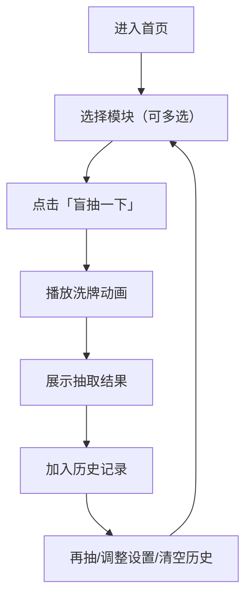

## 1. 产品概述
“今天吃什么盲抽”是一个桌面优先的单页网页应用：把常见家常菜、火锅、烤肉等按模块整理，用户一键盲抽出当餐选项，并支持锁定模块抽取、避免重复和快速再抽。
- 目标用户：每天纠结吃什么的上班族/学生/家庭用户
- 核心价值：用更有仪式感、更少决策成本的方式快速做出选择

## 2. 核心功能

### 2.1 功能模块
1. **首页（单页）**：标题与氛围区、模块选择区、盲抽主交互区、结果展示区、历史记录与再抽区、个性化设置区

### 2.2 页面详情
| 页面名称 | 模块名称 | 功能描述 |
|---|---|---|
| 首页 | 标题与氛围区 | 显示“今天吃什么”主题与一句可随机刷新的文案（如“别想了，交给命运”） |
| 首页 | 模块选择区 | 以卡片/标签形式展示模块：家常菜、火锅、烤肉、面食/粉面、轻食沙拉、下饭小馆；支持多选模块 |
| 首页 | 盲抽主交互区 | “盲抽一下”按钮；可选择抽取范围（所选模块/全模块）；抽取时展示滚动/洗牌动画 |
| 首页 | 结果展示区 | 展示抽到的菜品名称、所属模块、推荐搭配（可选）、“再抽一次/锁定模块再抽” |
| 首页 | 历史记录 | 展示最近 N 次抽取结果；支持一键清空 |
| 首页 | 个性化设置 | 开关：避免短期重复（默认开启）；可设置“重复冷却次数”（默认 5）；本地持久化 |

## 3. 核心流程
主要流程（自然语言）：
1. 用户进入首页，默认选中“全模块”抽取；也可勾选一个或多个模块限定范围。
2. 点击“盲抽一下”，进入抽取动画。
3. 动画结束后展示抽取结果，并记录到历史。
4. 用户可直接“再抽一次”，或在设置中开启/关闭“避免重复”，也可清空历史记录。

## 4. 用户界面设计

### 4.1 设计风格
- 视觉方向：夜市“霓虹菜单牌 + 小票打印”的反差混搭；整体偏暗底，亮色点缀，带轻微颗粒噪点与纸张纹理
- 主色：深墨黑/煤灰；辅色：辣椒红、青柠绿；高亮：暖黄（像灯箱）
- 字体：标题使用更有性格的手写/招牌感字体，正文使用易读的中文无衬线；尽量通过 Web Font 引入
- 按钮风格：高对比、带轻微外发光与按压位移；抽取按钮强调“可按”
- 布局：桌面优先的居中舞台（Stage）+ 两侧信息区；模块卡片使用不完全对齐的“贴纸”风格，增加趣味
- 动效：抽取时使用洗牌/滚动数字牌效果；结果卡片弹出与轻微晃动；悬停时卡片有偏移与阴影变化

### 4.2 页面设计概览
| 页面名称 | 模块名称 | UI 元素 |
|---|---|---|
| 首页 | 模块选择区 | 贴纸卡片、可选态描边与荧光阴影、多选提示、快捷“全选/清空” |
| 首页 | 抽取区 | 大按钮（发光 + 按压反馈）、抽取动画层、结果弹层卡片 |
| 首页 | 历史记录 | 列表卡片、最近项高亮、清空按钮、滚动容器 |
| 首页 | 设置区 | 开关、步进器（冷却次数）、本地保存提示（无侵入） |

### 4.3 响应式
- 桌面优先：≥ 1024px 为主体验
- 平板与移动端：布局变为单列，抽取按钮与结果卡片保持在首屏可见；历史与设置折叠为手风琴区域

