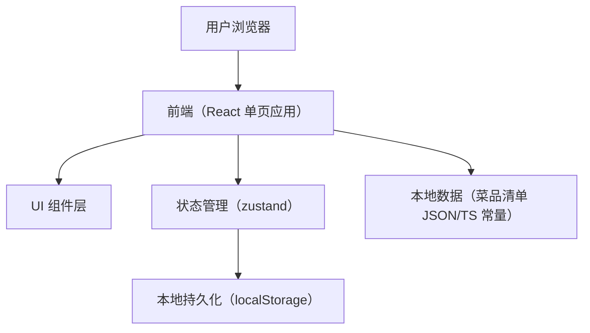

## 1. 架构设计

## 2. 技术说明
- 前端：React@18 + TypeScript + vite
- 样式：tailwindcss@3（用于布局与基础一致性）+ 少量自定义 CSS（用于霓虹/纹理/动画）
- 状态管理：zustand（模块选择、设置、历史记录、抽取状态）
- 后端：无（纯前端本地运行）
- 数据：内置菜品数据（按模块分组）；用户设置与历史记录存储在 localStorage

## 3. 路由定义
| 路由 | 用途 |
|---|---|
| / | 盲抽主页面（模块选择、抽取、结果、历史、设置） |

## 4. 数据模型

### 4.1 数据结构定义
- 模块（Category）
  - id: string（如 home, hotpot, bbq）
  - name: string（中文名称）
  - color: string（用于 UI 点缀的主题色）
- 菜品（Dish）
  - id: string
  - name: string
  - categoryId: string
  - tags?: string[]（如“微辣/下饭/快手”）
  - pairings?: string[]（可选：推荐搭配，如“米饭/冰可乐/蘸料”）
- 设置（Settings）
  - avoidRepeat: boolean（避免短期重复）
  - cooldown: number（重复冷却次数，默认 5）
  - selectedCategoryIds: string[]（多选）
- 抽取记录（HistoryItem）
  - id: string
  - dishId: string
  - dishName: string
  - categoryName: string
  - createdAt: number（时间戳）

### 4.2 本地存储键
- eatwhat.settings.v1：Settings
- eatwhat.history.v1：HistoryItem[]

